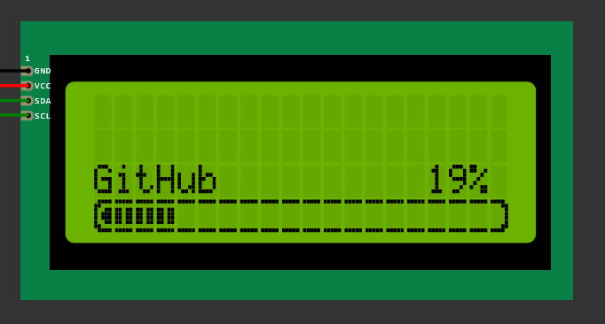

# Progressbar for Arduino LCD Display
This is a simple progressbar for Arduino LCD Display. It is based on the LiquidCrystal-I2C library.



**Fork of [skywodd](https://www.carnetdumaker.net/membres/skywodd/) Progress-Bar [script](https://www.carnetdumaker.net/articles/faire-une-barre-de-progression-avec-arduino-et-liquidcrystal/)**


## Usage
```cpp
void render_progressbar(byte progress, String message = "", bool displayPercentage = true, int textRow = lcd_rows-2, int barRow = lcd_rows-1)
```

### Parameters
- `progress` - Progress value (0-100)
- `message` - Message to display
- `(displayPercentage)` - Display percentage value (true/false)
- `(textRow)` - Row for the message + percentage
- `(barRow)` - Row for the progress bar


### Info for the original script
[Script](https://www.carnetdumaker.net/snippets/4/)  
[Post](https://www.carnetdumaker.net/articles/faire-une-barre-de-progression-avec-arduino-et-liquidcrystal/)
