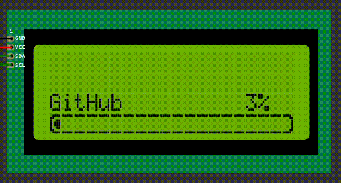

# Arduino LCD Progressbar
This library provides a simple progress bar for Arduino LCD displays using the LiquidCrystal-I2C library.



**Forked from [skywodd](https://www.carnetdumaker.net/membres/skywodd/) Progress-Bar [script](https://www.carnetdumaker.net/articles/faire-une-barre-de-progression-avec-arduino-et-liquidcrystal/)**  
[Original script details](#original-script)

## Links
- [Documentation](docs/README.md)
- [Arduino Script](src/progressbar.ino)

## Usage
```cpp
void render_progressbar(byte progress, String message = "", bool displayPercentage = true, int textRow = lcd_rows-2, int barRow = lcd_rows-1)
```

### Parameters
- `progress` - Progress value (0-100)
- `message` (optional) - Optional message to display
- `displayPercentage` (optional) - Whether to display the percentage (true/false)
- `textRow` (optional) - Row number for the message & percentage
- `barRow` (optional) - Row number for the progress bar

## Original Script
The original [script](https://www.carnetdumaker.net/snippets/4/) was authored by [skywodd](https://www.carnetdumaker.net/membres/skywodd/). For more details, refer to his [article](https://www.carnetdumaker.net/articles/faire-une-barre-de-progression-avec-arduino-et-liquidcrystal/) explaining the implementation.