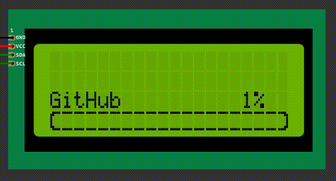
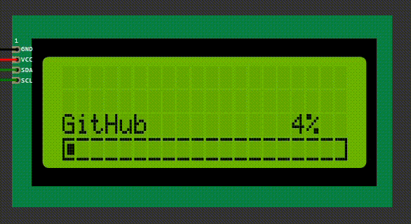
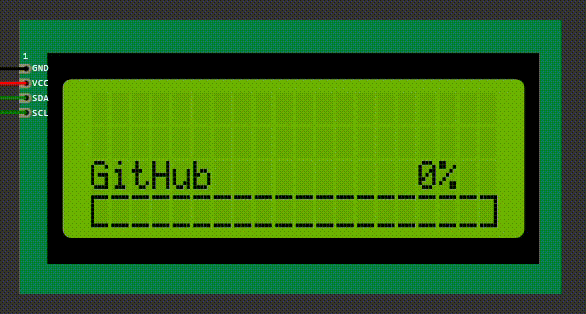

# Animations
You can change the animation of the progress bar by replacing the following variables:

```cpp
byte START_DIV_0_OF_4[8] = {};
byte START_DIV_1_OF_4[8] = {};
byte START_DIV_2_OF_4[8] = {};
byte START_DIV_3_OF_4[8] = {};
byte START_DIV_4_OF_4[8] = {};
byte DIV_0_OF_8[8] = {};
byte DIV_1_OF_8[8] = {};
byte DIV_2_OF_8[8] = {};
byte DIV_3_OF_8[8] = {};
byte DIV_4_OF_8[8] = {};
byte DIV_5_OF_8[8] = {};
byte DIV_6_OF_8[8] = {};
byte DIV_7_OF_8[8] = {};
byte DIV_8_OF_8[8] = {};
byte END_DIV_0_OF_4[8] = {};
byte END_DIV_1_OF_4[8] = {};
byte END_DIV_2_OF_4[8] = {};
byte END_DIV_3_OF_4[8] = {};
byte END_DIV_4_OF_4[8] = {};
```

# animations
- Round Corners
    - [Default](#round-corners-down-to-up-default)
    - [Left to Right](#round-corners-left-to-right)
- Block Corners
    - [Down to Up](#block-corners-down-to-up)
    - [Left to Right](#block-corners-left-to-right)


## Round Corners: Down to Up (Default)


<details>
<summary>CODE</summary>

```cpp
// DEFAULT (ROUND DOWN->UP)
byte START_DIV_0_OF_4[8] = {B01111, B11000, B10000, B10000, B10000, B10000, B11000, B01111};
byte START_DIV_1_OF_4[8] = {B01111, B11000, B10000, B10000, B10000, B10011, B11000, B01111};
byte START_DIV_2_OF_4[8] = {B01111, B11000, B10000, B10000, B10111, B10011, B11000, B01111};
byte START_DIV_3_OF_4[8] = {B01111, B11000, B10000, B10111, B10111, B10011, B11000, B01111};
byte START_DIV_4_OF_4[8] = {B01111, B11000, B10011, B10111, B10111, B10011, B11000, B01111};
byte DIV_0_OF_8[8] = {B11111, B00000, B00000, B00000, B00000, B00000, B00000, B11111};
byte DIV_1_OF_8[8] = {B11111, B00000, B00000, B00000, B00000, B11000, B00000, B11111};
byte DIV_2_OF_8[8] = {B11111, B00000, B00000, B00000, B11000, B11000, B00000, B11111};
byte DIV_3_OF_8[8] = {B11111, B00000, B00000, B11000, B11000, B11000, B00000, B11111};
byte DIV_4_OF_8[8] = {B11111, B00000, B11000, B11000, B11000, B11000, B00000, B11111};
byte DIV_5_OF_8[8] = {B11111, B00000, B11000, B11000, B11000, B11011, B00000, B11111};
byte DIV_6_OF_8[8] = {B11111, B00000, B11000, B11000, B11011, B11011, B00000, B11111};
byte DIV_7_OF_8[8] = {B11111, B00000, B11000, B11011, B11011, B11011, B00000, B11111};
byte DIV_8_OF_8[8] = {B11111, B00000, B11011, B11011, B11011, B11011, B00000, B11111};
byte END_DIV_0_OF_4[8] = {B11110, B00011, B00001, B00001, B00001, B00001, B00011, B11110};
byte END_DIV_1_OF_4[8] = {B11110, B00011, B00001, B00001, B00001, B11001, B00011, B11110};
byte END_DIV_2_OF_4[8] = {B11110, B00011, B00001, B00001, B11101, B11001, B00011, B11110};
byte END_DIV_3_OF_4[8] = {B11110, B00011, B00001, B11101, B11101, B11001, B00011, B11110};
byte END_DIV_4_OF_4[8] = {B11110, B00011, B11001, B11101, B11101, B11001, B00011, B11110};
```

</details>


## Round Corners: Left to Right



<details>
<summary>CODE</summary>

```cpp
// ROUND LEFT->RIGHT
byte START_DIV_0_OF_4[8] = {B01111, B11000, B10000, B10000, B10000, B10000, B11000, B01111};
byte START_DIV_1_OF_4[8] = {B01111, B11000, B10000, B10000, B10000, B10000, B11000, B01111};
byte START_DIV_2_OF_4[8] = {B01111, B11000, B10000, B10100, B10100, B10000, B11000, B01111};
byte START_DIV_3_OF_4[8] = {B01111, B11000, B10010, B10110, B10110, B10010, B11000, B01111};
byte START_DIV_4_OF_4[8] = {B01111, B11000, B10011, B10111, B10111, B10011, B11000, B01111};
byte DIV_0_OF_8[8] = {B11111, B00000, B00000, B00000, B00000, B00000, B00000, B11111};
byte DIV_1_OF_8[8] = {B11111, B00000, B10000, B10000, B10000, B10000, B00000, B11111};
byte DIV_2_OF_8[8] = {B11111, B00000, B11000, B11000, B11000, B11000, B00000, B11111};
byte DIV_3_OF_8[8] = {B11111, B00000, B11100, B11100, B11100, B11100, B00000, B11111};
byte DIV_4_OF_8[8] = {B11111, B00000, B11100, B11100, B11100, B11100, B00000, B11111};
byte DIV_5_OF_8[8] = {B11111, B00000, B11110, B11110, B11110, B11110, B00000, B11111};
byte DIV_6_OF_8[8] = {B11111, B00000, B11110, B11110, B11110, B11110, B00000, B11111};
byte DIV_7_OF_8[8] = {B11111, B00000, B11111, B11111, B11111, B11111, B00000, B11111};
byte DIV_8_OF_8[8] = {B11111, B00000, B11111, B11111, B11111, B11111, B00000, B11111};
byte END_DIV_0_OF_4[8] = {B11110, B00011, B00001, B00001, B00001, B00001, B00011, B11110};
byte END_DIV_1_OF_4[8] = {B11110, B00011, B10001, B10001, B10001, B10001, B00011, B11110};
byte END_DIV_2_OF_4[8] = {B11110, B00011, B11001, B11001, B11001, B11001, B00011, B11110};
byte END_DIV_3_OF_4[8] = {B11110, B00011, B11001, B11101, B11101, B11001, B00011, B11110};
byte END_DIV_4_OF_4[8] = {B11110, B00011, B11001, B11101, B11101, B11001, B00011, B11110};
```

</details>


## Block Corners: Left to Right



<details>
<summary>CODE</summary>

```cpp
// BLOCK LEFT->RIGHT
byte START_DIV_0_OF_4[8] = {B11111, B10000, B10000, B10000, B10000, B10000, B10000, B11111};
byte START_DIV_1_OF_4[8] = {B11111, B10000, B10000, B10000, B10000, B10000, B10000, B11111};
byte START_DIV_2_OF_4[8] = {B11111, B10000, B10100, B10100, B10100, B10100, B10000, B11111};
byte START_DIV_3_OF_4[8] = {B11111, B10000, B10110, B10110, B10110, B10110, B10000, B11111};
byte START_DIV_4_OF_4[8] = {B11111, B10000, B10111, B10111, B10111, B10111, B10000, B11111};
byte DIV_0_OF_8[8] = {B11111, B00000, B00000, B00000, B00000, B00000, B00000, B11111};
byte DIV_1_OF_8[8] = {B11111, B00000, B10000, B10000, B10000, B10000, B00000, B11111};
byte DIV_2_OF_8[8] = {B11111, B00000, B11000, B11000, B11000, B11000, B00000, B11111};
byte DIV_3_OF_8[8] = {B11111, B00000, B11100, B11100, B11100, B11100, B00000, B11111};
byte DIV_4_OF_8[8] = {B11111, B00000, B11100, B11100, B11100, B11100, B00000, B11111};
byte DIV_5_OF_8[8] = {B11111, B00000, B11110, B11110, B11110, B11110, B00000, B11111};
byte DIV_6_OF_8[8] = {B11111, B00000, B11110, B11110, B11110, B11110, B00000, B11111};
byte DIV_7_OF_8[8] = {B11111, B00000, B11111, B11111, B11111, B11111, B00000, B11111};
byte DIV_8_OF_8[8] = {B11111, B00000, B11111, B11111, B11111, B11111, B00000, B11111};
byte END_DIV_0_OF_4[8] = {B11111, B00001, B00001, B00001, B00001, B00001, B00001, B11111};
byte END_DIV_1_OF_4[8] = {B11111, B00001, B10001, B10001, B10001, B10001, B00001, B11111};
byte END_DIV_2_OF_4[8] = {B11111, B00001, B11001, B11001, B11001, B11001, B00001, B11111};
byte END_DIV_3_OF_4[8] = {B11111, B00001, B11101, B11101, B11101, B11101, B00001, B11111};
byte END_DIV_4_OF_4[8] = {B11111, B00001, B11101, B11101, B11101, B11101, B00001, B11111};
```

</details>


## Block Corners: Down to Up



<details>
<summary>CODE</summary>

```cpp
// BLOCK DOWN->UP
byte START_DIV_0_OF_4[8] = {B11111, B10000, B10000, B10000, B10000, B10000, B10000, B11111};
byte START_DIV_1_OF_4[8] = {B11111, B10000, B10000, B10000, B10000, B10111, B10000, B11111};
byte START_DIV_2_OF_4[8] = {B11111, B10000, B10000, B10000, B10111, B10111, B10000, B11111};
byte START_DIV_3_OF_4[8] = {B11111, B10000, B10000, B10111, B10111, B10111, B10000, B11111};
byte START_DIV_4_OF_4[8] = {B11111, B10000, B10111, B10111, B10111, B10111, B10000, B11111};

// | SAME AS IN DEFAULT
// v
byte DIV_0_OF_8[8] = {B11111, B00000, B00000, B00000, B00000, B00000, B00000, B11111};
byte DIV_1_OF_8[8] = {B11111, B00000, B00000, B00000, B00000, B11000, B00000, B11111};
byte DIV_2_OF_8[8] = {B11111, B00000, B00000, B00000, B11000, B11000, B00000, B11111};
byte DIV_3_OF_8[8] = {B11111, B00000, B00000, B11000, B11000, B11000, B00000, B11111};
byte DIV_4_OF_8[8] = {B11111, B00000, B11000, B11000, B11000, B11000, B00000, B11111};
byte DIV_5_OF_8[8] = {B11111, B00000, B11000, B11000, B11000, B11011, B00000, B11111};
byte DIV_6_OF_8[8] = {B11111, B00000, B11000, B11000, B11011, B11011, B00000, B11111};
byte DIV_7_OF_8[8] = {B11111, B00000, B11000, B11011, B11011, B11011, B00000, B11111};
byte DIV_8_OF_8[8] = {B11111, B00000, B11011, B11011, B11011, B11011, B00000, B11111};
// ^
// |  SAME AS IN DEFAULT

byte END_DIV_0_OF_4[8] = {B11111, B00001, B00001, B00001, B00001, B00001, B00001, B11111};
byte END_DIV_1_OF_4[8] = {B11111, B00001, B00001, B00001, B00001, B11101, B00001, B11111};
byte END_DIV_2_OF_4[8] = {B11111, B00001, B00001, B00001, B11101, B11101, B00001, B11111};
byte END_DIV_3_OF_4[8] = {B11111, B00001, B00001, B11101, B11101, B11101, B00001, B11111};
byte END_DIV_4_OF_4[8] = {B11111, B00001, B11101, B11101, B11101, B11101, B00001, B11111};
```

</details>

